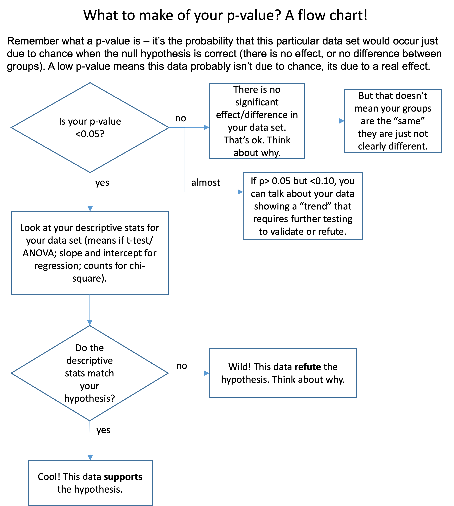
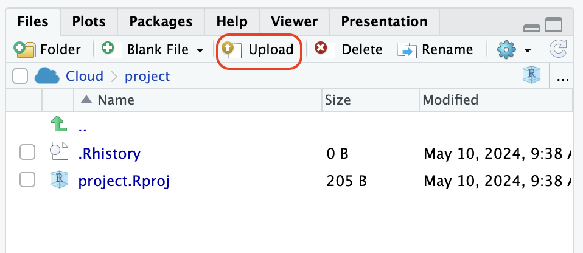
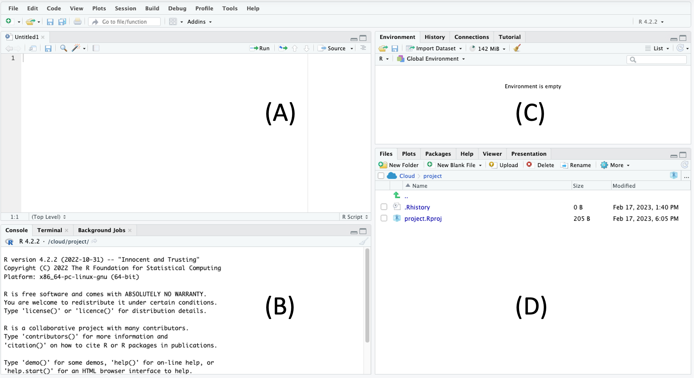
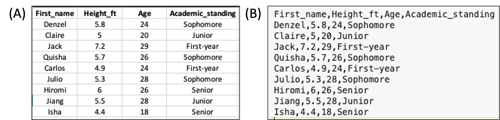
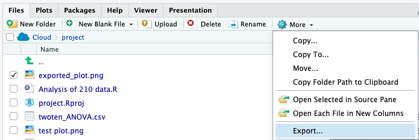

```{r, echo=FALSE, eval=FALSE}

# Note about making html and docx output (for Google Doc)

# code for html output

---
title: "Big Red Statistics in R"
# output: word_document
format: html
date: "`r Sys.Date()`"
toc: true
toc-depth: 4
toc_float: true
project:
  type: website
  output-dir: docs
code-overflow: wrap
---

# code for doc output

---
title: "Big Red Statistics in R"
output: 
  word_document:
    reference_docx: style.docx
format: html
date: "`r Sys.Date()`"
toc: true
toc-depth: 4
toc_float: true
project:
  type: website
  output-dir: docs
code-overflow: wrap
---

# To add this to an existing Google Doc, first upload the whole docx to google, then copy and paste the relevant section

# To generate a table of content of ONLY the R guide on Google Doc, click Insert > Table of Content. Then in the table of content, remove the sections are are not needed.
  
  
```

# I. Overview of the scientific method

Biologists are interested in organisms (either unicellular or multicellular), populations, and/or communities in a variety of contexts, including their molecular biology, physiology, growth, development, behavior, ecology, and evolution. Regardless of their specific interest, biologists usually rely on the **scientific method** to obtain information if it is not already available in the scientific literature. The scientific method consists of several steps: 1) making observations, 2) asking a question, 3) forming a hypothesis, 4) designing and executing an experiment to test the hypothesis, 5) analyzing the data (including a statistical test, if appropriate), 6) interpreting the results, and 7) communicating the results (usually with a table or graph).

An experiment often involves one or more **variables**; these may be **numeric** variables, expressed as numbers (e.g. "2.4 cm"), **nominal** variables, expressed as named categories (e.g. "female" vs. "male"), or **ordinal** variables, expressed as positions (e.g. "first'' vs. \`\`second" vs. "third"). The type of variable(s) determines the type of analysis that should be applied. In the case of numeric variables, the data may be **continuous** corresponding to an infinite range of values (e.g. as when measuring the length of a leaf) or **discrete**, corresponding to whole numbers (e.g. as when counting the number of stomata in a leaf).

In most cases, an experiment involves determining if a **dependent variable** is affected by an **independent variable** (e.g. as when counting the number of offspring -- dependent - to determine if temperature -- independent - has any effect on reproduction), or determining if there is a relationship between the two variables that may or may not involve cause and effect (e.g. as when you measure the weight of an organism to determine if it is related to the height of the organism).

The word "**hypothesis**" is used in slightly different ways in experimental design and statistics. Typically, when designing an experiment, the hypothesis is an educated guess about what you think might happen. It is generally expressed as a relationship between your two variables; e.g., plants that receive more light (independent variable) will grow taller (dependent variable). But when you go to analyze your data with statistics, you will use the term hypothesis with more nuance. Statistical tests help you determine if there is a significant relationship between your variables. When you do a statistical test, the default assumption is that there is NO relationship between your variables (amount of light has no impact on plant height). This default is called the "**null hypothesis**". Thus, the null hypothesis is typically the opposite of the experimental hypothesis. The experimental hypothesis (referred to statistically as the alternative hypothesis) predicts a specific relationship between variables; **the null hypothesis predicts no meaningful relationship between variables.**

If the results of an experiment are consistent with the null hypothesis, and thus do not support the biologist's experimental hypothesis, then the researcher must conclude that there is no evidence of a significant relationship between the variables. The experimental hypothesis is either rejected or it is modified and subjected to additional testing. If the results of an experiment are inconsistent with the null hypothesis, then there IS a significant relationship between the variables which may support the experimental hypothesis, but the hypothesis may be subjected to additional testing as it is replicated and refined.

An experiment should be **controlled** to ensure that the results are not attributed to **confounding variables** (as when the dependent variable is affected by something other than the independent variable). In some cases, the biologist might utilize an **experimental group** (e.g. individuals that receive a treatment) as well as a **control group** (e.g. individuals that do not receive a treatment). In other cases, the biologist might utilize a **positive control** (which should produce results) and/or a **negative control** (which should not produce results). In all cases, it is ideal to perform multiple, identical trials (or replicates) and to test multiple subjects (i.e. a large **sample size or large number of replicates**) to ensure that there is a consistent outcome for the experiment.

There are additional ways to deal with confounding variables; these are by **randomization** and by **matching**. If you randomize the collection of your data, then you avoid the possibility that the effects you observe are due to confounding variables. For example, if I'm testing the effects of fertilizer on growth, but I chose all of my control plants in an area full of sunlight and all of my experimental plants in an area of heavy shade, then the differences in growth due to my fertilizer manipulation could be masked by the differences in sunlight. The remedy in this case is to randomly select control and experimental plants in both shady and sunny areas. Another way to control for confounding variables is through **matching** your control and experimental samples. As in the example above, if I placed a control and an experimental plant near each other ('matching the samples') in each habitat then the differences I observe are less likely due to differences in environmental variables that could confound my results.

A hypothesis becomes a **theory** if the results of many additional, independent tests continue to support it. A theory is an explanation that is supported by such a wide body of evidence that it is accepted as fact. Thus, biologists' use of the term "theory" differs significantly from that of the general public who use the term when referring to speculation. One example of a theory is the theory of evolution, which is accepted as fact although there is still much for biologists to learn about natural selection and other mechanisms that result in a change in the relative frequency of alleles within a population over different time scales (i.e. micro versus macroevolution).

------------------------------------------------------------------------

# II. The importance of statistical tests

Biologists often apply a statistical test for a less biased approach to interpreting the results of an experiment. A statistical test will estimate the probability of producing the observed result under the null hypothesis. In particular, it will yield a **p value**, which is the probability of producing the observed result by chance when there is actually no relationship between variables (e.g., when the null hypothesis is true). The p value ranges from 0 to 1, with 0 being no chance of producing this data set by chance if there is no relationship, and 1 being a 100% chance of producing this data set when there is no relationship. **If the p value is less than 0.05**, then the null hypothesis is rejected and the results are referred to as "significant," indicating that there is a significant relationship between the variables. It is important to note that the value is a probability and thus the conclusion you draw from the p value could still be inaccurate as in the case of **false positives** (referred to as Type I errors), in which the data deviate from the null hypothesis by chance, and **false negatives** (referred to as Type II errors), in which the data erroneously support the null hypothesis (often due to the sample size being limited). Let's reiterate those definitions:

-   Type I error (false positive): for your sample, the p value is \<0.05 indicating a relationship between variables, but there would be no relationship if you measured a different or larger population.

-   Type II error (false negative): for your sample, the p value is \>0.05 indicating no relationship between variables, but there would be a relationship if you measured a different or larger population.

The threshold that marks significance for the p value is referred to as the **α value**. The choice of α = 0.05 is standard, but arbitrary. It is possible to select a different significance level prior to the experiment. However, if you increase your significance level, say to 0.1, you increase your chance of a false positive, and if you decrease your significance level, say to 0.01, you increase your chance of a false negative.



------------------------------------------------------------------------

# III. Descriptive statistics

***Mean***

The **mean (**$\bar{X}$**)** (often referred to as the average) corresponds to the sum of the measurements divided by the number of measurements (as in the case of 10, 40, 25, 35, and 40, which produce a mean of 30). In the case of an odd number of measurements, the **median** corresponds to the measurement in the middle when all of the measurements are sorted from lowest to highest (as in the case of 10, 40, 25, 35, and 40, which produces a median of 35). In the case of an even number of measurements, the median corresponds to the mean of the two measurements in the middle when all of the measurements are sorted from lowest to highest. Finally, the **mode** corresponds to the most common measurement (as in the case of 10, 40, 25, 35, and 40, which produces a mode of 40).

***Standard deviation***

The standard deviation (s) is a measure of the distribution of the data (i.e. extent of variation among different subjects) and weights each value by its distance from the mean. There is an increase in the standard deviation if there is a large distance of the values from the mean (as in the case of 10, 40, 25, 35, 40, which have a mean of 30). In contrast, there is a decrease in the standard deviation if there is a small distance (if any) of the values from the mean (as in the case of 25, 30, 35, 30, 30, which have the same mean of 30). The result for each group is summarized as the mean "plus or minus" the standard deviation ($\bar{X}$ ± s). This gives you a lot of information about the data set. If someone describes a data set as the mean plus or minus one SD, they are giving you the range into which 68% of the data points fall. Mean ± 2 SD gives you the range of 95% of the data, and Mean ± 3 SD encompasses 99% of the data. Note that on a bar graph or boxplot the standard deviation is sometimes represented by vertical lines known as error bars that extend from the mean in both an upward and downward direction.

{width="300"}

***Standard error***

The standard error of the mean (SEM), or simply the **standard error** (SE) is another common way to state the variation around the mean. Instead of telling you about the range of the data set, it tells you the range of the "true" mean. If you added one sample to your study or took one sample away, the mean may change a little. So your mean is correct for your group of samples, but not necessarily for the whole population of all organisms that could have been in your study. SEM tells you that if you could have included every possible subject or sample - the mean probably would have been somewhere in this range. Once you have calculated the standard deviation of the mean (s), it is easy to calculate SE.

{width="80"}

n = the number of samples or trials or replicates. This technique results in a smaller number than the standard deviation (s) offers, and thus often makes graphs with error bars look smaller. Whether to use s or SE in reporting your statistics and making error bars varies depending on the application, style, and field. Be sure to find out what your instructor prefers for your assignments!

***Coefficient of variation***

The **coefficient of variation (CV)** corresponds to the standard deviation divided by the mean and is useful when comparing the amount of variation for one variable among groups with different means.

\
The variance in data sometimes fits a **normal distribution** (i.e. bell curve on a graph); such data are subject to a parametric test. However, the variance in data sometimes does not fit a normal distribution; such data are subject to a non-parametric test (addressed in advanced coursework).

------------------------------------------------------------------------

# IV. Key steps in data analysis using R

Here is the basic steps to analyze your data in R.

1.  Access Posit Cloud (<https://posit.cloud/>) online or RStudio on your computer.

2.  Create or open a project.

3.  Create or open an R script.

4.  If you are starting a new project, install a set of required packages by entering a code in the Script Panel and running it.

5.  Prepare R to use those packages by 'loading' the packages. Do this every time!

6.  In Excel, save your data into a .csv file. If needed, edit your data in Excel.

7.  Upload the .csv file into Posit Cloud or RStudio.

8.  Read your data file into R by entering a code.

9.  If needed, generate descriptive statistics on one or more of the variables in your data set.

10. If not done prior to data collection, decide which inferential statistical test to use, such as a t-test, ANOVA, linear regression, or Chi-squared test.

11. **Locate the general code for the test you want to use and type (or copy & paste) the code into the Script Panel in R.**

12. **If needed, substitute the names of your data file and variables into the general code.**

13. **Press `Run` in the upper right corner of the script panel. The output will appear in the Console Panel.**

14. If needed, trouble-shoot errors that show up in the Console Panel.

15. Once the code is running correctly, decide what the output is telling you. For instance, do the findings lead you to accept or reject the test's null hypothesis?

16. If needed, run a post hoc test.

17. Visualize the findings of your statistical test by making a graph in R or table in Excel.

18. Export or copy your graph into your lab assignment or into your research paper. Also record the needed statistical output, such a F or P values, so you can finish your lab assignment or use the output when writing a research paper.

19. Save the R script.

------------------------------------------------------------------------

# V. Start using R

## A. Access R via Posit Cloud or RStudio

R is a command line program in which you interact through text (the command line) instead of a graphical user interface (e.g., Windows, Excel, etc.). We provide two options for running R through an integrative environment called RStudio. In both options, you will not interact directly with R. You will run RStudio through Posit Cloud or RStudio software downloaded to your computer. Your instructor will let you know how you should use R for the class.

-   The online version of RStudio is called **Posit Cloud**. Sign up for an account [here](https://posit.co/products/cloud/cloud/). The "Cloud Free" option will be sufficient. Do not choose the PLUS or other options. Your instructor will send you a link to get access to a shared class space, which has more memory and run time allocations than the "Cloud free" account.

-   If directed by your instructor, you can download RStudio and install it on your computer. Depending on the version of RStudio and R, the interface and commands could be slightly different from the online version. Follow the instructions [here](https://posit.co/download/rstudio-desktop/) to download and install both R and RStudio.

## B. Project setup and file transfer

### **Online - Posit Cloud**

For the online option, you will need to upload data to the cloud or download output files from the cloud. The benefit is that you can use R anywhere and on virtually any machine with the internet (even a tablet)!

Once in the classroom space, you will see project assignments that your instructor has created for you. Your instructor will also have access to your assignments in this space. In some cases, your instructor may have created a template that includes pre-installed packages.

To create your own project on Posit, click `New Project > New RStudio Project` on the upper right. You should rename your project(s) as directed by your instructor.

{#fig-NewProject width="300"}

Once the project is deployed, on the lower right panel, click the `Upload` button and choose the data file from your computer (e.g., a `.csv` file).

{#fig-upload width="300"}

To download a file to your computer (e.g., a saved graph), check the box next to the file you want to export, click `More > Export…` and click `Download`.

{#fig-export width="300"}

### **Local - RStudio**

If you choose the local option, you should set up a project and a folder that is associated with this project where all files will be stored.

For example, create a folder on your desktop that is called "R_is_fun". Start RStudio, click `File > New Project…` and select `Existing Directory` and browse to the folder `R_is_fun`.

Then click `Create Project`. Now you can access all files in the folder `R_is_fun` (without indicating the full pathname). Everything you saved in R will also appear in this folder.

## C. Starting an R script

Once your project is opened, you should create an **R script**. The R script is a text file where your R commands and notes (after hashtags #) will be saved.

To do this, click `File > New File > R Script`.

To save the R script, click `File > Save` and give it an informative name. You should rename your R script(s) as directed by your instructor. The R script will be saved to a file with a .R extension. It is a text file that can be opened in any text editor.

**Important: You must save your R script for your instructor to see and troubleshoot your codes.**

## D. The RStudio Interface

Let's introduce what is being displayed in Posit and RStudio. With an R script opened, you should see a default four-panel interface.

{#fig-RStudio_interface}

-   $A$ The upper left is the R **Script Panel**. This is where you will write and save your R script or commands. The panel should be saved regularly, which serves as a record of all the commands that you have (or are planning) to run. The scripts here are not being read by R until you click the `Run` button on the top right.

-   $B$ The lower left is the R **Console Panel**, which is the innate command line interface of R. A command from the R script above will be displayed here when you click the `Run` button, which is when R "reads" your command. Any output or error from R will also be displayed here. You could type your command directly here, but it will not be saved in the R script.

-   $C$ The upper right is the **Environment Panel**. Objects that are read or generated in R will be displayed here.

-   $D$ The lower right is the **Files Panel**. It displays the files in your working directory. In Posit cloud, you will see files uploaded to the course space by your instructor. It also displays figures in the `Plots` tab if your commands result in graphical outputs. The `Packages` tab indicates which packages are currently installed, while check marks indicate which ones are loaded in the library. The `Help` tab displays the manual for each package and command.

For a more comprehensive introduction to RStudio, see [here](https://education.rstudio.com/learn/beginner/).

## E. R packages

Many packages are available to expand the basic functions of base R. This is similar to adding a plug-in or extension to your web browser.

### Installing packages

To use these packages, you have to install them when you start the project for the first time. You will not need to install them again when you start an old project.

After installing the packages, you have to load the package as libraries.

We will install a few packages that will be used in this document:

-   Type the codes below into the Script Panel (top left, Panel A), exactly as shown.

-   Highlight all the codes and hit the `Run` button on the top right of the Script Panel. Alternatively, use the keyboard shortcut `Ctrl+Enter` (PC) or `Cmd+Enter` (Mac).

-   You may be asked to select a mirror to download the packages and enter `Y` to update packages.

-   A number of output should show up in the Console Panel to report the installation progress.

```{r, eval = FALSE, collapse = TRUE, warning = FALSE, error=FALSE, message = FALSE}

# Run these only once when you first start the project:

install.packages("ggplot2")
install.packages("Rmisc")
install.packages("agricolae")

# In most command-line interfaces, words after # are not read by the software and serve as notes.

# We will explain the R syntax below in "Importing data into R"

```

Alternatively, you can install packages from the `Package` tab on the Files Panel (Panel D). Click `Install` and type the package name in the box (it will auto-complete for you to prevent typos).

{width="207"}

### Loading packages

Then, we will load these packages such that functions from these packages can be used. *Note: You WILL need to run library() for each package EVERY TIME you start a new Project. But you will not need to install them again.*

```{r, collapse = TRUE, warning = FALSE, error=FALSE, message = FALSE}

# Run these every time before you run anything else:

library("ggplot2")
library("Rmisc")
library("agricolae")

```

------------------------------------------------------------------------

# VI. Importing data into R

## A. Preparing a .csv file from Excel

Your data should be entered and stored in spreadsheet programs such as Microsoft Excel before being imported into R. While R can read Excel files (A) such as .xls and .xlsx, data are typically saved into a simpler text format such as .csv (comma-separated values, B), where each row appears in a new line and each column is separated by a comma (,).

It is important to have a header line (the first row) that specifies the column names.

{#fig-excel}

A spreadsheet in Excel can be exported into .csv by clicking `File > Save As…` and selecting `CSV` in the drop-down manual under `File Format`.

Try doing this with `name.xlsx` which can be downloaded from [here](https://drive.google.com/drive/folders/18p2BJvPVNJhLtYQ-HolEADr5Hwpi67JB?usp=sharing) (<https://tinyurl.com/5dpk43x7>)

Place the .csv file into your project's directory (e.g., R_is_fun) or upload it to your project in posit.cloud using the Files pane.

Now, you should see the .csv file listed in the File Panel (Panel D) of RStudio.

{#fig-FilePanel width="450"}

## B. Loading a .csv file into R

Note that while the `name.csv` file is in the file panel, it has not been loaded into R yet. It is merely present in the folder on the cloud (or your computer). To load the file into R, in the R Script Panel (Panel A), type or paste:

```{r}
data_name = read.csv(file = "name.csv")

```

| Here is a breakdown of the R syntax:

| `data_name` is a name of the **object** (in the form of a data frame, see below) that we are assigning to the output of `read.csv(file = "name.csv")` via a `=` sign.
| 
| `read.csv()` is a function. It is typically shown in blue.
| 
| You can pass "arguments" inside the `()` to specific how the function should operate. They are typically shown in various shades of green. A function can have no argument, or many arguments separated by commas (,).
| 
| In read.csv(), the first argument is `file` and we pass the value `"name.csv"` to this argument after the `=`.
| 
| The value of an argument can be a number, logical argement (Ture/Fales), the name of an object in R, or text. WIth some exceptions (e.g., in ggplot), text values should be under a quotation mark (" ") to distinguish it from the name of an object.
| 
| Since R knows the expected sequence of arguments (this is called positional argument), you could skip the argument's name and just write: `data_name = read.csv("name.csv")`

There are many other arguments in `read.csv`. To see them, type `?read.csv` in the Console Panel (Panel B) to display the Help page in the File Console (Panel D). In this example, the default arguments work (e.g., header = TRUE, sep = ",") because `name.csv` has a header row and values are separated by ",". So `data_name = read.csv("name.csv")` is doing the same command as `data_name = read.csv("name.csv", header = TRUE, sep = ",")`. Because of this default arguments, R may read a csv file incorrectly if it does not have a header line. **So be sure to include column names in the .csv file.**

The code above will read `name.csv` into R and save it as an "object" called `data_name`. An object is data that is stored in R. Objects are different from files that are being imported into Posit Cloud and RStudio. Objects can be used in the Script or Console Panel (e.g., by running `data_name`), but files in the File Panel cannot.

Now the object `data_name` will appear in the Environment Panel (Panel C).

{#fig-env_panel width="450"}

In the environment panel, you can click on the object to open it in a new tab in the Script Panel. Note that doing it actually sends a code to the Console Panel as `View(data_name)`

You can show the content of the object in the Console Panel by running (or "calling") it directly:

```{r}
data_name

```

As shown above, when you view an object in the console panel, the file has loaded correctly. The 9 rows and 4 columns are present, as well as the column names.

The object is a *data frame*, which stores a two-dimensional table that is like a spreadsheet with columns and rows. There are many other classes of R object, see [here](https://swcarpentry.github.io/r-novice-inflammation/13-supp-data-structures/) for other classes in R. We will only be using data frames in this guide.

```{r}
class(data_name)

```

With data frame, you can show the column titles with:

```{r}
names(data_name)
```

You can show the content of a column by:

```{r}
data_name$Academic_standing

# Note that once you typed data_name$, R will automatically show you the avaliable column names. You can click on it to avoid typo.
```

Tips:

-   After you type a command (e.g., `aov()`), you can hit the tab key and RStudio will show the possible arguments.

-   RStudio will auto-complete the close bracket.

-   If you need to edit your data, the easiest way is to to it in Excel, then upload it to Posit Cloud and read it into R. See the Appendix if you need to edit your data in the .csv file or object within R.

------------------------------------------------------------------------

# VII. How to generate descriptive statistics

Let's say that you measure the length of 12 seashells. Here are the instructions for determining the mean and standard deviation using R:

Follow the instructions in the previous section to enter your continuous data into a new data frame called `seashells`. In this case your dependent variable is `Length_cm` of the seashells.

For example, you can first enter your data into Excel, save it as `seashells.csv`, and upload that to your project's directory in Posit.

{#fig-seashellexcel width="103"}

Then you can load it as a data frame called `seashells`

```{r, eval=FALSE}
seashells = read.csv("seashells.csv")

```

Alternatively, you also run this code to manually enter the data:

```{r}
seashells = data.frame("Length_cm" = c(3, 4.5, 3.1, 4.2, 4.4, 4, 3.6, 3.7, 3.1, 2.8, 4.3, 5))

```

Either way, your data should look like this:

```{r}
seashells

```

You can check whether Length_cm is continuous (i.e, numeric in R).

```{r}
class(seashells$Length_cm)

```

| `$` is an "operator" to get a column from a data frame's table.

`seashells$Length_cm` means that from the data frame `seashells`, show the column called `Length_cm`. \| \| Then, the function `class()` is applied to the column to examine the "class" of the column, which will typically be "numeric" for a continuous variable and "character" for a categorical variable.

Generate a quick histogram of the data, if you have a continuous variable.

```{r, out.width="50%"}
hist(seashells$Length_cm)

```

Generate basic summary statistics:

```{r}
summary(seashells$Length_cm)

```

You can generate the mean, standard deviation (SD) and standard error (SE) using the function `summarySE()` in the package `Rmisc`. Here on the first line, we are saving the output of `summarySE()` as an object called `seashell_length_summary`. Then on the second line, we call the object to show its content. The saved object is very useful as we will need this to make a bar graph of the data (see Visualization in [A. T-test] or [B. ANOVA] below).

```{r}
seashell_length_summary = summarySE(data = seashells, measurevar = "Length_cm")

seashell_length_summary

```

You can also calculate the means and standard deviations of different groups at the same time. Let's say you measured 12 shells again, but in this experiment you used 3 different species. You can calculate the means and standard deviations of the different species by inputting your data in the following way:

```{r}
# We will add another column to the data frame
seashells$Species = c(rep("Species1", 4), 
                      rep("Species2", 4), 
                      rep("Species3", 4))


# To view the data:
seashells

```

Then use `summarySE()` with an additional groupvars argument:

```{r}
seashell_lengthXsp_summary = summarySE(data = seashells, measurevar = "Length_cm", groupvars = "Species" )

seashell_lengthXsp_summary

```

With this data, you can make a table in Excel to summarize descriptive statistics of seashell lengths of the three species.

{#fig-meanshell width="300"}

#### Boxplot

Boxplot is a good way to visually examine your data before running any analysis. It will show you the distribution of the data and any outlines. For most test we assume that the data is normally distributed. There are ways to deal with non-normally distributed data, but they are not covered in this guide (e.g., transformation or generalized linear models).

```{r, out.width="50%"}
# Note that we use the RAW data, not the summarized data from summarySE for boxplot.

ggplot(data = seashells, aes(x = Species, y = Length_cm)) + 
  geom_boxplot() 

# In the ggplot command, we are telling it to look for the data in seashells, and then plot Species on the x and Length_cm on the y axis. Then geom_boxplot() specifies the type of plot to use 

# If there are any outlier, it will be plot as a point beyond the whiskers. 
# See ?geom_boxplot, under Summary statistics, about what are being plotted in the boxplot.
```

You can find more details about the ggplot command later in Visualization under [A. T-test]

------------------------------------------------------------------------

# VIII. Inferential statistics & graphs

*Step One: Figure out what statistical test you should use!*

How do you do that? First, you should be able to clearly write out your experimental question, your hypothesis, and identify your dependent and independent variables.

Once you have your variables identified, determine if they are continuous (measurement) data or nominal (categorical) data. Now you can use the chart below to figure out which type of statistic is right for you. Note that each combination of variable types also has a type of graph or table that is typically used to display the data! Instructions for how to run each stat and make each figure are given in the sections that follow.

{#fig-stat}

------------------------------------------------------------------------

## A. T-test

### Two-sample t-test

A **t-test is used when the independent variable is nominal (categorical) and has exactly two categories (such as an experimental group and a control group) and the dependent variable consists of continuous (measurement) data**. In this case, you are determining if there are differences in the means of the dependent variable between the two categories of the independent variable.

Let's say that you want to test if a fertilizer has a significant effect on the growth of plants. You measure the height of 10 plants, 5 grown with just soil and 5 grown with soil and added fertilizer. Both groups are grown for the same length of time. Here are the instructions for performing a t-test (for comparing two groups) using R:

According to [VI. Importing data into R], import `fertilizer.csv` from the shared drive ([here](https://drive.google.com/drive/folders/18p2BJvPVNJhLtYQ-HolEADr5Hwpi67JB?usp=sharing) or <https://tinyurl.com/5dpk43x7>) as a data frame named `fertilizer`. Also, be sure you are [Loading packages].

(See [Appendix 2. Create data frames in R] if you want to create a data frame manually in R.)

```{r, echo=FALSE}
# Make a data frame called fertilizer
fertilizer = data.frame("Treatment" = c(rep("Soil", 5), 
                                        rep("Soil+fertilizer", 5)),
                        "Plant_height_cm" = c(10.5, 13, 9, 11, 14, 
                                              17, 18.5, 20, 16, 17.5))

# Note that the new lines are only used for a better display. They are not interpreted by R.# rep("Soil", 5) repeats "Soil" five times. 
# It's the same as c("Soil", "Soil", "Soil", "Soil", "Soil")

write.csv(fertilizer, "./csv files/fertilizer.csv", row.names = F)

# to read:
# read.csv("./csv files/fertilizer.csv")
```

```{r}
# This is what the data frame should look like:
fertilizer

```

```{r}
# The data has two treatment levels:
unique(fertilizer$Treatment)

```

To test whether `Plant_height_cm` is different between `Treatment` , in other word, whether `Treatment` affects `Plant_height_cm`, **we will use `t.test()`**:

```{r}
t.test(Plant_height_cm ~ Treatment, data = fertilizer)

# Note the default settings for alternative and var.equal. Type ?t.test to find out more. 
# t.test(Plant_height_cm ~ Treatment, data = fertilizer, alternative = "two.sided", var.equal = TRUE)
```

The argument `alternative` can also be "greater" or "less" if you have an a priori reason to test for a directional difference between groups.

In this case, the p-value is 0.0005. We reject the null hypothesis that `Treatment` has no effect on `Plant_height_cm`. Hence, we can write a summary statement like:

> Plants grown in soil with fertilizer were taller than plants grown soil with no fertilizer (t = -5.601, d.f. = 8, p = 0.0005 or p \< 0.001)

### **Visualization**

Biologists often display the results of an experiment in the form of a graph. There are a few types of graphs encountered in biology: bar graph, boxplot, scatter plot, and line graph. Bar graph and boxplot are useful when your independent variable is categorical and your dependent variable is continuous. Scatter plot and line graph are useful if both variables are continuous. Otherwise, they share many of the same features including a title and labels for the X and Y-axes (including the units of measurement, if any). **The predictor (independent) variable is plotted on the X-axis, while the response (dependent) variable is plotted on the Y-axis.** Refer to your instructor for guideline about writing figure captions.

You can plot the continuous variable from two groups with a bar graph or boxplot.

#### Bar graph

In this example, we will use the data frame `fertilizer`, which was used above for the t-test. We will plot the mean `Plant_height_cm` across different `Treatment` and add an error bar that represents the standard deviation (or standard error if needed).

Because the data frame `fertilizer` does not have the mean or standard deviation, we will use `summarySE()` to generate the mean, SD, and SE by group, similar to how we generated descriptive statistics in [VII. How to generate descriptive statistics].

```{r, warning=FALSE}
# We will store the result of summarySE as a new object called heightXtrt_summary

heightXtrt_summary = summarySE(data = fertilizer, 
                                       measurevar = "Plant_height_cm", 
                                       groupvars = "Treatment")


# Take a look at heightXtrt_summary

heightXtrt_summary

```

We can then use `heightXtrt_summary` to build a bar graph.

```{r, out.width="50%"}
# Note that we are NOT using the raw data (fertilizer) here!

ggplot(data = heightXtrt_summary, aes(x = Treatment, y = Plant_height_cm)) + 
  geom_col(fill = "lightblue", color = "black") + 
  geom_errorbar(aes(ymin = Plant_height_cm - sd, ymax = Plant_height_cm + sd), width = 0.2) + 
  labs(x = "Treatment", y = "Plant height (cm)") 

```

| The `ggplot` function is from the `ggplot2` package. It results multiple functions connected by `+`. The new line are not required, but are used for a better organization of the codes.
| 
| `ggplot()` specifies a data frame used for plotting with `data = heightXtrt_summary` and the x and y variables to use with `aes(x = Treatment, y = Plant_height_cm)`.
| 
| `geom_col()` adds the bar graph.
| The bar graph displays the values in the column `Plant_height_cm` as y, which are the means of `Plant_height_cm` grouped by `Treatment` in the object `heightXtrt_summary`.
| Then, `fill="lightblue"` and `color = "black"` controls the color of the box and the color of the outline, respectively. You can see all colors [here](https://r-charts.com/colors/).
| 
| `geom_errorbar()` adds the error bar.
| The argument `aes(ymin = Plant_height_cm - sd, ymax = Plant_height_cm + sd)` specifies the coordinates of the top and bottom of the error bar. In this case, the error bar will begin (ymin) at the mean minus SD and end (ymax) at the mean plus SD).
| The argument `width = 0.2` controls the width of the error bar.
| 
| The last line `labs(x = "Treatment", y = "Plant height (cm)")` specifies the x and y axis labels.
| 
| You will need at least the first two lines (connected by +) to build a ggplot. For example: `ggplot(data = heightXtrt_summary, aes(x = Treatment, y = Plant_height_cm)) + geom_col()`

When visualizing data, it is sometime beneficial to show the raw data. We can overlap the data points on a bar graph using `geom_jitter()`, which spreads out the points horizontally to avoid overlapping points with the y-values.

```{r, out.width="50%"}
ggplot(data = heightXtrt_summary, aes(x = Treatment, y = Plant_height_cm)) + 
  geom_col(fill = "lightblue", color = "black") + 
  geom_errorbar(aes(ymin = Plant_height_cm - sd, ymax = Plant_height_cm + sd), width = 0.2) + 
  labs(x = "Treatment", y = "Plant height (cm)") +
  geom_jitter(data = fertilizer)

```

#### Exporting graphs

To export your plot from Posit Cloud, go to the `Plot` tab on the Files Panel and click `Export`.

{width="300"}

-   You can simple do `Copy to Clipboard` and paste the figure into other programs on your computer. This option may not work for all programs and operation systems.

-   With `Save as Image…`, you can adjust the image size so that the font size and image size would fit the document where you intend to use the image for (e.g., lab report, presentation, or poster). You should enter an informative name in the box next to `File name:`.

After exporting the figure, it will appear as an image file in the Files Panel in Posit Cloud or as a file in the project's folder in RStudio on your computer. For Posit Cloud, you should download the image file to your computer.

In the Files Panel, check the box next to the image file that you want to download. Click `More` and choose `Export`. In the pop-up window, click `Download`.

{width="450"}

#### Boxplot

Another good way to display the same data is to use a boxplot.

```{r, out.width="50%"}

ggplot(data = fertilizer, aes(x = Treatment, y = Plant_height_cm)) + 
  geom_boxplot() +
  labs(x = "Treatment", y = "Plant height (cm)")
```

Type `?geom_boxplot` in the Console Panel to show the help page for `geom_boxplot()`. The values displayed by the hinges and whiskers are explained in the section "Summary statistics". Note that the boxplot does not display SD and SE.

You can also overlay the raw data point in a boxplot

```{r, out.width="50%"}
# There is no outlier data in this example. However, when an outlier is present, it will be displayed as a point by geom_boxplot(). 
# The argument outlier.colour = "grey" is used to specify the color of the outlier point to be different from points generated by geom_jitter. You can even turn off all outlier by outlier.color = NA.

ggplot(data = fertilizer, aes(x = Treatment, y = Plant_height_cm)) + 
  geom_boxplot(outlier.colour = "grey") +
  labs(x = "Treatment", y = "Plant height (cm)")+
  geom_jitter(width = 0.1) 

```

```{r, echo=FALSE, results='hide', message=FALSE, warning=FALSE, fig.show='hide'}
# 210 Example: T test (For Faculty only)

# Here's a sample of how the 210 data can be analyzed.

# After loading 210_t_test.csv into posit.cloud

TwoTen_data = read.csv("210_t_test.csv") 


# Note: Object name cannot begin with numbers. so 210_data will not work.

# Checking if the file is loaded correctly

TwoTen_data

summary(TwoTen_data)

unique(TwoTen_data$AminoAcid)
```

```{r, echo=FALSE, results='hide', message=FALSE, warning=FALSE, fig.show='hide'}
# Run t test

t.test(Values~AminoAcid, data = TwoTen_data, var.equal = TRUE)

# Note: The above is the same as: t.test(Values~AminoAcid, data = fertilizer, alternative = "two.sided", var.equal = FALSE)
# We can skip a lot of the default arguments. 
```

```{r, echo=FALSE, results='hide', message=FALSE, warning=FALSE, fig.show='hide', out.width="50%"}
# And now plot it

ggplot(data = TwoTen_data, aes(x = AminoAcid, y = Values)) + 
  geom_boxplot(outlier.colour = "grey") +
  geom_jitter(width = 0.1) +
  labs(x = "Nutrient", y = "Ring size (cm)")

# Yes, glucose is not Amino acid! Dispite the wrong labal in the data, we can change it in the plot.

# If you need to change the (column) name on the data frame, please see the section "Editing data in .csv and data frame"
```

```{r, echo=FALSE, results='hide', message=FALSE, warning=FALSE, fig.show='hide', out.width="50%"}

# We can also do a bar graph after using summarySE() to calculate the average, SD, and SE.

TwoTen_data_summary = summarySE(TwoTen_data, "Values", "AminoAcid")


# Bar graph

ggplot(data = TwoTen_data_summary, aes(x = AminoAcid, y = Values)) + 
  geom_col() +
  geom_jitter(data = TwoTen_data, width = 0.1, height = 0) +
    geom_errorbar(aes(ymin=Values-sd, ymax=Values+sd), width=.2,
                 position=position_dodge(.9)) +
  labs(x = "Nutrient", y = "Ring size (cm)")

# Note: the jittered data need to be retrived from the raw TwoTen_data, so it's loaded via aes() in the argument of geom_jitter().
```

------------------------------------------------------------------------

## B. ANOVA

### Global ANOVA test

**An ANOVA is used in a similar circumstance as a t-test: nominal independent variable and continuous dependent variable, but when there are three or more categories for the independent variable (perhaps you tried multiple experimental treatments)**. If this test is significant, you must then perform additional "post hoc" tests to determine exactly which pair(s) of groups are significantly different from one another.

Let's say you want to measure the effectiveness of penicillin in disrupting *E. coli* growth. To see if doses of penicillin differ in effectiveness, we will test 3 different concentrations as well as a control (no penicillin). The response variable in this case is measured in CFU (colony forming unit).

**Here are the instructions for performing an ANOVA (for comparing more than 2 groups) in R:**

According to [VI. Importing data into R], import `penicillin.csv` from the shared drive ([here](https://drive.google.com/drive/folders/18p2BJvPVNJhLtYQ-HolEADr5Hwpi67JB?usp=sharing) or <https://tinyurl.com/5dpk43x7>) as a data frame named `penicillin`. Also, be sure you are [Loading packages].

```{r, echo=FALSE}

# Run this code to enter the data manually.
penicillin = data.frame(
  Penicillin_conc = c(rep("Zero",5), rep("Low", 5), rep("Medium", 5), rep("High",5)), 
  CFU = c(795, 711, 703, 798, 775, 
          602, 696, 602, 689, 709, 
          489, 475, 411, 677, 654, 
          2, 0, 2, 1, 0))


write.csv(penicillin, "./csv files/penicillin.csv", row.names = F)

# to read:
# read.csv("./csv files/penicillin.csv")

```

```{r}
# This is what the data frame should look like:
penicillin
```

### ***Ordering categorical variables***

Often time, when we have a categorical variable, the alphabetical order may not be what we want to show up on a graph. There is a way to tell R how the levels should be ordered. The order will not affect the ANOVA results, but it will affect the visualization. But it is a good idea to set the level earlier.

Before doing so it is generally a good idea to check the levels or unique entries of your categorical variable. You may found out that there are typos or extra spaces in your .csv file. You should then edit the .csv file and load the data into R again.

```{r}
unique(penicillin$Penicillin_conc)
```

The code below will adjust the column `Penicillin_conc` to be a **ordered factor** with `ordered = T` and indicate the order with `levels = c( )`. If not, ggplot will arrange it alphabetically.

```{r}
penicillin$Penicillin_conc = factor(penicillin$Penicillin_conc, ordered = T, levels = c("Zero", "Low", "Medium", "High"))


# A common source of error is typos in the levels. To avoid it, copy and paste the names from the output of unique( ) instead of typing. 

# Also, if your categorical variable does not require reordering, you do not need to do this step. 
```

### ***ANOVA***

To test whether `Penicillin_conc` affects `CFU`, we will build the model using `aov()`, then use `summary()` to show the full results:

```{r}
p_anova_model = aov(formula = CFU ~ Penicillin_conc, data = penicillin)

summary(p_anova_model)
```

Note that the results are similar to the F-test for linear regressions, because ANOVA and regression are both linear models. But in ANOVA, we don't have predictions of slope and intercepts.

The p value is shown below `Pr(>F)`. In this case, since the p-value (3.21e-11) is \<0.05, we reject the null hypothesis that `Penicillin_conc` has no effect on `CFU` Therefore, we can write a summary statement to say:

> Penicillin concentration affects CFU in *E. coli* (F = 121.5, d.f. = 3 and 16, p \< 0.0001)

### ***Post hoc test***

[*If the p value is below 0.05, you must run post hoc tests to compare the means.*]{.underline}

We can compare all means using **Tukey HSD** to obtain information about which pair(s) of penicillin concentrations are significantly different from one another.

```{r}
hsd = HSD.test(p_anova_model, trt = "Penicillin_conc")

hsd

# You can show the output directly with 
# HSD.test(p_anova_model, trt = "Penicillin_conc", , console = T)
# Saving it to hsd and calling hsd is not a must. But the object hsd is needed for R to plot the letters, if you choose to do so.
```

Under `$groups`, the letters indicate which groups are significantly different from each other in a post hoc test. Groups with the same letter are not significantly different from each other (e.g., Zero and Low, which both have "a"), while groups with different letters are significantly different (e.g., Medium and High, which has "b" and "c", respectively).

You can find the p value of each comparison with:

```{r}
HSD.test(p_anova_model, trt = "Penicillin_conc", group = F, console = T)
```

### **Visualization**

#### **Bar graph**

Similar to a t-test, we can create a bar graph with error bars after using `summarySE()` to generate the mean, SD, and SE for each predictor group.

```{r, out.width="50%"}
penicillin_summary = summarySE(data = penicillin, measurevar = "CFU", groupvars = "Penicillin_conc")

ggplot(data = penicillin_summary, aes(x = Penicillin_conc, y = CFU)) +
  geom_col() + 
  geom_errorbar(aes(ymin = CFU - sd, ymax = CFU + sd), width = .2) +
  labs(x = "Penicillin concentration") 
```

Your final figure should include the post hoc letters from `hsd`. You could export the graph to add the letters manually. Alternatively, you can do it in R using the data frames `penicillin`, `penicillin_summary`, and `hsd` created above.

```{r}
# We will use the letters from hsd to build a temporary data frame (temp_label) to help us label the plot. It will have the data from hsd$means and the group letters from hsd$groups. 

temp_label = merge(hsd$means, hsd$groups, by = c("row.names", names(hsd$means)[1]))

# We need to have a column called Penicillin_conc so that ggplot can refer to this column. Instead of manually specifying the column name, we will retrieve it from hsd$parameters$name.t 

names(temp_label)[1] = hsd$parameters$name.t 

temp_label
```

Bar plot:

```{r, out.width="50%"}
# Here, geom_text takes data from temp_label and add the post hoc letters to the plot.  
# as.factor(Penicillin_conc) is used in case the column is numeric instead of categorical
# y = Max + max(Max)*0.1 calculates a y-coordinate to place the label based on the Max values of the data.
# Jittered data point is included here for your reference.

ggplot(data = penicillin_summary, aes(x = as.factor(Penicillin_conc), y = CFU)) +
  geom_col() + 
  geom_errorbar(aes(ymin = CFU - sd, ymax = CFU + sd), 
                width=.2, outlier.color = NA) +
  labs(x = "Penicillin concentration") + 
  geom_jitter(data = penicillin, aes(x = Penicillin_conc, y = CFU), 
              width = 0.2) + 
  geom_text(data = temp_label, aes(x = Penicillin_conc, 
                                   y = Max + max(Max)*0.1, 
                                   label = groups))

```

#### **Box plot**

Similar to the t-test, we can plot the data used for ANOVA using a boxplot.

```{r, out.width="50%"}
ggplot(data = penicillin, aes(x = Penicillin_conc, y = CFU)) + 
  geom_boxplot() +
  labs(x = "Penicillin concentration") 

# If needed add this command to rotate and right-justify the axis text. 
# + theme(axis.text.x = element_text(angle = 90, hjust = 1))
```

Similar to the bar plot, we can overlay the raw data and post hoc letters to a boxplot.

```{r, out.width="50%"}

ggplot(data = penicillin, aes(x = Penicillin_conc, y = CFU)) + 
  geom_boxplot(outlier.colour = NA) +
  geom_jitter(width = 0.1, height = 0) + 
  labs(x = "Penicillin concentration") + 
  geom_text(data = temp_label, aes(x = Penicillin_conc, 
                                   y = Max+  max(Max)*0.1, 
                                   label = groups))

```

###  {data-link="Adding post hoc grouping into bar graph and boxplot"}

```{r, echo=FALSE, results='hide', message=FALSE, warning=FALSE, fig.show='hide'}

# 210 Example: ANOVA (For Faculty only)

# Here is a sample code to analyze the 210 data.

# You can download a sample data, twoten_ANOVA.csv, here. Note that we are not analyzing both strains (TA1535 and TA1538) in one ANOVA (we could but it gets messy!). twoten_ANOVA.csv has data from only the TA1535 strain. Students should run the analysis separately for each strain.

# After loading twoten_ANOVA.csv into posit.cloud

ames = read.csv("twoten_ANOVA.csv") 


# Note: Object name cannot begin with numbers. so 210_data will not work.

# Checking if the file is loaded correctly

ames
summary(ames)
unique(ames$line)
unique(ames$treatment)
```

```{r, echo=FALSE, results='hide', message=FALSE, warning=FALSE, fig.show='hide'}

# If needed, we can adjust treatment to be a ordered factor.

ames$treatment = factor(ames$treatment, ordered = T, 
                        levels = c("4-NOP", "NaN3", "water"))


summary(ames)
# Note how the summary differs slightly for treatment.
```

```{r, echo=FALSE, results='hide', message=FALSE, warning=FALSE, fig.show='hide'}

# Run the global ANOVA

ames_anova_model = aov(formula = values ~ treatment, data = ames)

summary(ames_anova_model)
```

```{r, echo=FALSE, results='hide', message=FALSE, warning=FALSE, fig.show='hide'}

# Post hoc Tukey HSD test


TukeyHSD(ames_anova_model)

```

```{r, echo=FALSE, results='hide', message=FALSE, warning=FALSE, fig.show='hide'}

# Getting the letter groups

library(agricolae) # In case you haven't loaded this.

ames_hsd = HSD.test(ames_anova_model, trt = "treatment", group = T)

ames_hsd

```

```{r, echo=FALSE, results='hide', message=FALSE, warning=FALSE, fig.show='hide'}

# Simple boxplot without letters

ggplot(data = ames, aes(x = treatment, y = values)) + 
  geom_boxplot() +
  geom_jitter(width = 0.1, height = 0) + 
  labs(x = "Treatments", y = "CFU")
```

```{r, echo=FALSE, results='hide', message=FALSE, warning=FALSE, fig.show='hide'}

# If you'd like a log scale:

ggplot(data = ames, aes(x = treatment, y = values)) + 
  geom_boxplot() +
  geom_jitter(width = 0.1, height = 0) + 
  labs(x = "Treatments", y = "CFU") +
  coord_trans(y = "log10")

# Of cause you can also do y = log10(values)
```

```{r, echo=FALSE, results='hide', message=FALSE, warning=FALSE, fig.show='hide'}

# We can then add the letters. 
# But we first need to extract the letters from hsd to build a data frame to help us label the plot

ames_temp_label = merge(ames_hsd$means, ames_hsd$groups, by = c("row.names", names(ames_hsd$means)[1]))

names(ames_temp_label)[1] = ames_hsd$parameters$name.t

ames_temp_label
```

```{r, echo=FALSE, results='hide', message=FALSE, warning=FALSE, fig.show='hide'}

# We also need summarySE to get the mean, SD and SE if we are doing a bar graph

ames_summary = summarySE(data = ames, measurevar = "values", groupvars = "treatment")

ggplot(data = ames_summary, aes(x = treatment, y = values)) +
  geom_col(fill = "lightblue") + 
  geom_errorbar(aes(ymin=values-sd, ymax=values+sd), width=.2,
                 position=position_dodge(.9)) +
  labs(x = "Treatments", y = "CFU") + 
  geom_jitter(data = ames, aes(x = treatment, y = values), width = 0.2) + 
    geom_text(data = ames_temp_label, aes(x = treatment, 
                                   y = Max+max(Max)*0.1, 
                                   label = groups)) #+
  scale_y_continuous(trans='log10')
  # coord_trans(y = "log10") # This doesn't work somehow.
```

------------------------------------------------------------------------

## C. Linear regression

### Simple linear regression

A linear regression is employed to determine if there is a relationship between two variables, X and Y **when both variables are continuous** (numerical or measurement) type data. In other words, whether the slope of the linear regression line is different from zero (remember a flat line has a slope of zero). This statistical test will also indicate the direction and magnitude of the relationship. The direction is inferred from the slope of the line (m), while the magnitude or strength of the relationship is inferred from the coefficient of determination (R2). If R2 = 1, then the line is a perfect "fit," meaning that Y can be predicted from X (or vice versa) using the equation of the line (y = mx + b). If R2 \< 1, then the line is not a perfect "fit," meaning that only a proportion of Y can be predicted from X (or vice versa) using the equation of the line (y = mx + b). For example, if R2 = 0.94, then 94% of the variation in Y can be explained by X. Note that the equation of the line is ONLY relevant if there is a significant relationship (p \< 0.05).

Let's say that you want to determine if the chirp rates of the snowy tree cricket are related to temperature. You measure the temperature and the rate of 10 chirping crickets at those respective temperatures. Since crickets are ectotherms and their metabolism is affected by their external environment, we should expect to see an increase in chirping as temperature increases.

According to [VI. Importing data into R], import `chirps.csv` from the shared drive ([here](https://drive.google.com/drive/folders/18p2BJvPVNJhLtYQ-HolEADr5Hwpi67JB?usp=sharing) or <https://tinyurl.com/5dpk43x7>) as a data frame named `chirps`. Also, be sure you are [Loading packages].

We have two continuous variables `temperature` and `chips_per_min`.

```{r, echo=FALSE}

# Create a data frame called chirps using the command data.frame()
# Inside data.frame(), we provide the name of a column with "temperature = " and the value of each row with c().

chirps = data.frame(temperature = c(31, 22, 34, 29, 27, 24, 21, 29, 26, 29), chirps_per_min = c(79, 64, 79, 73, 69, 62, 59, 70, 64, 68))

write.csv(chirps, "./csv files//chirps.csv", row.names = F)

```

```{r}
# Display the data frame chirps
chirps
```

In R the `lm` function can fit a number of linear models, including linear regression.

The code below creates a linear model (lm_CT) to predict `chirps_per_min` (the response or dependent variable) by `temperature` (the predictor or independent variable):

```{r}
lm_CT = lm(formula = chirps_per_min ~ temperature, data = chirps)

```

We can view results of the linear regression using `summary()`.

```{r}
summary(lm_CT)
```

Here is an explanation of the output:

Under "Coefficients", it shows a table with two rows corresponding to (1) the intercept and (2) the slope (of the predictor variable, i.e., temperature) and four columns:

-   **Estimate: the estimated intercept and slope of the linear regression line.**

-   Std. Error: Standard error of the estimate

-   t value: test statistics from a t test of whether the estimate is significantly different from zero.

-   **Pr(\>\|t\|): P value of the t test**

In the last three lines, it shows:

-   Residual standard error: lower values suggest better fit (i.e., less distance between the data point and the predicted line).

-   **Degrees of freedom: the maximum number of logically independent values.**

-   **Multiple R-squared: the percentage of the variation in the response (dependent) variable that the model (dependent variables) explains.**

-   Adjusted R-squared\*: R-squared adjusted for the number of terms in the model. Use this to compare models with more than one predictor variable.

-   F-statistics: Statistics of a F-test that evaluates the fit of the model.

\*If there are multiple predictor variables, although the F-test is at the end of the statistical output, it should be examined first to determine whether the linear model fits the data. Only when the model is well fitted (as judged by the F- and P-values), should you further interpret the significance of the slope of a particular predictor.

In this example, the linear regression is significant because the p-value of the F test is lower than 0.05 (p = 0.000117), so we can continue to examine the intercept and slope.

The slope is 1.5556 (under "Estimate" in "Coefficient") and the t-test indicates that it is significantly different from zero (p = 0.000117). Note that this p-value is the same as that of the F-test only when there is a single predictor variable. In multiple regression, there will be separate t-tests for each predictor variable.

Therefore, we can write a statement to summarize the result and provide statistical support:

> **There is a positive relationship between temperature and chirp rate (slope =** 1.556**, F = 48.47, d.f. = 1 and 8, p =** 0.0001**).**

### Visualization

#### Scatter plot / Line plot

For the data frame `chirps`, we will plot `temperature` as the predictor (independent) variable on the X axis and chirps_per_min as the response (dependent) variable on the Y axis. A linear regression line will be added.

```{r, message=FALSE, out.width="50%"}
ggplot(data = chirps, aes(x = temperature, y = chirps_per_min)) + 
  geom_point() + 
  geom_smooth(method = lm, se = F, color = "red") +
  labs(y = "Chirps per minute", x = expression("Temperature " ( degree*C)))

```

[Always do the following (regardless of the result):]{.underline} Make sure your axes are labeled properly in Title Case and include units of measure.

[If the p-value is significant, do the following:]{.underline} show the linear fit on the graph (as shown above).

[If the p-value is not significant:]{.underline} this means the line fit is not meaningful, so just show the scatter plot without the linear fit (as shown below).

```{r, out.width="50%"}
ggplot(data = chirps, aes(x = temperature, y = chirps_per_min)) + 
  geom_point() + 
  labs(y = "Chirps per minute", x = expression("Temperature " ( degree*C)))

```

Some instructors or journals prefer to display an insignificant trend with a dashed line:

```{r, message=FALSE, out.width="50%"}
ggplot(data = chirps, aes(x = temperature, y = chirps_per_min)) + 
  geom_point() + 
  geom_smooth(method = lm, se = F, color = "grey", linetype = "dashed") +
  labs(y = "Chirps per minute", x = expression("Temperature " ( degree*C)))
```

------------------------------------------------------------------------

## D. Two types of Chi-square (X^2^) tests

**Chi-Square tests are used when both the dependent and independent variables are nominal or categorical.**

### **Chi-square - Goodness of Fit test**

The **Goodness of Fit test** is used to determine if the observed result (i.e. collected during an experiment) is significantly different than the "expected" result (i.e. that based on the laws of probability). It involves calculating the degrees of freedom (DF), which corresponds to the following equation: DF = (C -- 1) where C is the number of categories. It also involves calculating the Chi-square value (X^2^), which corresponds to the following equation: X^2^ = $\sum{D^2/E}$ where D is the difference between the observed result (O) and the expected result (E). The biologist determines if the X^2^ value is less than the "critical" X^2^ value for an experiment with a particular DF to determine if there is a significant difference (p value \< 0.05) between the observed and expected result.

{#chisq width="450"}.

Let's say that you have crustaceans and test their preference for a light or dark environment. In this example there is only ONE variable: the observed preference (are they in the light or dark when you check on them?). You want to see if the distribution of crustaceans is random (roughly 50% in the light and 50% in the dark because they have no preference and distribute according to the laws of probability) OR if the distribution is non-random because they prefer either dark or light.

The **null hypothesis** for this test is that the variable of interest (light/dark environment) will have no impact on the distribution of the data. In other words, the null hypothesis assumes a random distribution, which means the **observed is no different from the expected**. If p\>0.05, you accept the null.

A **significant result** (p\<0.05) means the distribution of your **observed data is different than expected**; it is non-random.

The goodness of fit Chi-square test is used to test whether the distribution of a categorical variable is significantly different than an "expected" distribution.

For example, in a species of crustacean, we counted the number of individuals that prefer a light and a dark treatment. We may expect the light:dark ratio to be 1:1 and we can test it with the chi-square goodness of fit test.

According to [VI. Importing data into R], import `crust_sp1.csv` from the shared drive ([here](https://drive.google.com/drive/folders/18p2BJvPVNJhLtYQ-HolEADr5Hwpi67JB?usp=sharing) or <https://tinyurl.com/5dpk43x7>) as a data frame named `crust_sp1`. Also, be sure you are [Loading packages].

```{r, echo=FALSE}
crust_sp1 = data.frame(Crustacean = "Species 1", Result = c("light", "light", "dark", "light", "light", "light", "light", "light", "dark", "dark", "light", "light", "light", "light", "light", "light", "light", "dark", "dark", "dark", "light", "light", "light", "light"))

write.csv(crust_sp1, "./csv files//crust_sp1.csv", row.names = F)
```

We will create a file in a "long form":

```{r}

crust_sp1
```

We can convert this into the "short form":

```{r}
crust_table = table(crust_sp1[,"Result"])

crust_table
```

With your own data, you could directly enter the counts in the short form as a data frame:

```{r}
crust_df = data.frame("Treatment" = c("dark", "light"), "Count" = c(6, 18))

crust_df
```

We can then test whether the observed distribution of `Result` is equally distributed among the two groups (i.e., 1:1) using `chisq.test()`.

```{r}
chisq.test(x = crust_table)

# You can do the same analysis with the count data in a data frame
# chisq.test(crust_df2$Count)
```

The X-squared value (6) is the "Pearson" test chi-square value. It is used, with the degrees of freedom (df) value, to obtain the p-value from a chi-squared table.

The null hypothesis of the test is that the groups are equally distributed. The p-value is \< 0.05, which means that we can reject the null hypothesis. Therefore, our observed distribution of light preferences by crustaceans is significantly different from 1:1.

#### **Visualization**

There are several ways of visually representing X^2^ results in either a figure or a table. Ask your instructor about their preference.

*For a table*:

The table should be [a simplified version]{.underline} of the table R used to run the analysis.

{#fig-chisq_table width="450"}

*For a graph*:

The type of graph used to display frequency (count) data is called a histogram.

You can plot the data for a goodness-of-fit Chi-square test by using the raw data in `crust_sp1`.

```{r, out.width="50%"}
ggplot(data = crust_sp1, aes(x = Result, fill = Result)) +  # fill tells R to color the bar by Result
  geom_bar() +
  labs(x = "Result", y = "Count") + 
  theme(legend.position = "none") # remove the side legend
```

Alternative, you could also plot using the count data `crust_table` after converting it to a data frame. You can also use `crust_df` directly.

```{r, fig.keep = "none"}
ggplot(data.frame(crust_table), aes(Var1, Freq, fill = Var1)) + 
  geom_col() + 
  labs(x = "Result", y = "Count") + 
  theme(legend.position = "none") 

```

You can make the same plot using the count data in a data frame.

```{r, fig.keep = "none"}
ggplot(crust_df, aes(Treatment, Count, fill = Treatment)) + 
  geom_col() + 
  labs(x = "Result", y = "Count") + 
  theme(legend.position = "none") 
```

### Chi-square - Contingency test

The **Contingency test**, also called the **Test of Independence**, is used to determine if the frequency of outcomes for one set of observations matches those for another set of observations.

For example, let's imagine that we want to know whether two different species of crustaceans exhibit the same preference for light or dark. In other words, is the preference for light or dark contingent on which species it is? To find this out one uses a version of a Chi-square test known as a contingency table.

In this case, your **independent variable** is species and your **dependent variable** is preference (because you think preference might depend on species); your null hypothesis is that there is no difference in the preference for light versus dark between Species 1 and 2. When you run a contingency test you produce a X^2^ value as in the Goodness of Fit test. If the X^2^ value is large enough (leading to p\<0.05), then you can reject the null hypothesis that the proportion of crustaceans showing a preference for light is **not different** between the two species, and state that the data shows that the preference for light or dark **is contingent** on the species. Another way to say the same thing: the two species show significantly different preferences for light.

Let's imagine that we test the preference of two crustacean species for light versus dark and compare the preferences. The values could be arranged in a table like the one below.

{#fig-Contingency_data width="450"}

If the preferences of the two species were the same, they should each have roughly the same frequencies as the pooled results, which show animals split between dark and light, with possibly a small preference for dark (28 dark and 20 light). Do species 1 and 2 appear to have similar preferences? Note that the total number of observations/ occurrences does not have to be the same for both species. A contingency test will correct for different sizes between samples.

We will begin by creating the data for species 2. Alternatively, according to [VI. Importing data into R], import `crust_sp2.csv` from the shared drive ([here](https://drive.google.com/drive/folders/18p2BJvPVNJhLtYQ-HolEADr5Hwpi67JB?usp=sharing) or <https://tinyurl.com/5dpk43x7>) as a dara frame named `crust_sp2`.

```{r}
crust_sp2 =  data.frame(Crustacean = "Species 2", Result = c(rep("dark", 22), rep("light", 2)))

crust_sp2

```

Then we will add it to the previous `crust_sp1` to make a new object:

```{r, echo=T, results='hide'}
crust_twoSp = rbind(crust_sp1, crust_sp2)

crust_twoSp

# The table is very long; so we are not displaying it here.

# rbind() combines two data frames by adding the second datafrome (crust_sp2) to the bottom on the first data frame (crust_sp1).

```

We will first reshape our data into a contingency table using `table()`:

```{r}
crust_twoSp_table = table(crust_twoSp$Crustacean, crust_twoSp$Result)

crust_twoSp_table

```

With your own data, you can choose to enter the counts directly as a data frame:

```{r}

crust_twoSp_df = data.frame("Treatment" = c("dark", "light", 
                                            "dark", "light"), 
                            "Count" = c(6, 18, 
                                        22, 2), 
                            "Species" = c("Species 1", "Species 1", 
                                          "Species 2", "Species 2"))
# Note that the new lines are for display purpose only.

crust_twoSp_df
```

We can then test the null hypothesis that there is no difference in the preference for light versus dark between Species 1 and 2.

```{r}
chisq.test(crust_twoSp_table)

# With the count data in a data frame, it needs to be converted to a table
# chisq.test(xtabs(Count ~ Species + Treatment, data = crust_twoSp_df))

```

#### **Visualization**

You can plot the contingency table from the long form using `geom_bar()`:

```{r, out.width="50%"}

ggplot(data = crust_twoSp, aes(x = Result)) + geom_bar() + facet_grid(~Crustacean) +
  labs(x = "Result", y = "Count")

```

You can also plot the data using the short form using `geom_col()`:

```{r, fig.keep = "none"}

ggplot(data.frame(crust_twoSp_table), aes(Var2, Freq)) + 
  # fill tells R to color the bar by Var1
  geom_col() + 
  labs(x = "Result", y = "Count") + 
  facet_grid(~Var1)

```

You can do the same with the data frame.

```{r, fig.keep = "none"}
ggplot(crust_twoSp_df, aes(Treatment, Count)) +
  geom_col() +
  facet_grid(~Species) +
  labs(x = "Result", y = "Count")

```

------------------------------------------------------------------------

# Appendix

## Appendix 1. Editing data in R

Some times you would need to edit your data after loading it into R. There are two options.

1.  (Beginner) Modify the .csv file that was uploaded to Posit.

    -   Click on the .csv file in the `Files` panel and click `View File`.

    -   It will open the .csv file in the top left panel.

    -   You can modify any values there and save it.

    -   **Once the editing is done, you must load the file into R again using read.csv().**

    -   Note: If you are using Posit Cloud, this option modifies the .csv file on the cloud, but the file on your computer is NOT modified.

2.  (Advanced) Modify the data frame that was loaded into R.\
    \
    It is a good practice to keep a record of all editing in your R script and to not modify the raw data file. To do this, we will modify the data frame that is already loaded into R, using codes that will be saved in the R script. Keep reading if you want to try this option.

After loading the data into R as a data frame, you can modify it using the command line.

We will use `test_df` as an example:

```{r}
# Create a data frame called test_df using the command data.frame()

test_df = data.frame(Pred = c("A","A", "B",'B'), Response = 1:4)

# Notes: 
# Inside data.frame(), we provide the name of a column with "Pred = " or "Response= " and the value of each row with c("A","A", "B",'B') or 1:4.
# 1:4 is the same as c(1, 2, 3, 4)
# For non-numeric values inside c(), we need to add "" around the characters.

# Display the data frame test_df
test_df

```

### Changing column names

**Option 1.** You can change the column name after knowing the index (position) of the name that needs to be changed.

For example, we want to change `Pred` to `Predictor`.

```{r}
# Display the column names of test_df to check the index of Pred
# Index refer to the position of an element in a vector (or list)
names(test_df)

```

```{r}
# Since "Pred" is the first element in names(test_df), we can use the index in the next command to change it.

names(test_df)[1] = "Predictor"

# Display test_df to check
test_df

```

**Option 2.** We can write one line to change the name without knowing what index it is. It's useful if you have a larger data frame with lots of columns.

For example, we want to change `Response` to `Values`.

```{r}
names(test_df)[names(test_df)=="Response"] = "Values"

test_df

# Breaking down the one-liner:
# names(test_df)=="Response" # gives a True/False logical vector
# names(test_df)[...] # call what's inside the square bracket
# names(test_df)[names(test_df)=="Response"] # So this calls what's TRUE in the logical vector, which is the name "Response".
# The last command (= "Values" ) assign a new name for what's on the left side of the equal sign.

```

There are many other ways to do it. You can explore on your own!

### Changing values in a data frame

This is best done by knowing the index of the column and row of the cell that needs to be changed.

For example, if we want to change the 3 to 300 in test_df:

```{r}
# We can first take a look at the data frame
View(test_df)

```

```{r}
# Since we know that it's in the third row and the second column, we can do this:

test_df[3,2] = 300

test_df

# Note that indexing for data frame goes from row to column in R
# R start counting from 1. (While other programming language, like Python, starts at 0.)
# So [3,2] means row 3 and column 2

```

### Combining text from two columns

For example, we have a data frame called `test_df2` and want to combine the columns `Variable1` and `Variable2` into a new column.

```{r}
# Create test_df2
test_df2 = data.frame(Variable1 = c("Cold","Cold",'Hot',"Hot"),
                      Variable2 = c("North","East",'South',"West"),
                      Response = 1:4)

# Display test_df2. It has three columns.
test_df2

```

```{r}
# Create a new column called Treatment in test_df2
# Do that by pasting the values from each row of Variable1 and Variable1, and separating them with " and ".
# Note that the spaces flanking "and" is needed.
test_df2$Treatment = paste(test_df2$Variable1, test_df2$Variable2, sep = " and ") 
# Note: avoid using sep = "&" as it may cause an error!

# Display test_df2. It should have the fourth column.
test_df2

```

------------------------------------------------------------------------

## Appendix 2. Create data frames in R {data-link="How to graph in R"}

Sometime you may need to create a data frame in R for testing purpose.

```{r}
# Make a data frame called fertilizer2
fertilizer2 = data.frame("Treatment" = c(rep("Soil", 5), 
                                        rep("Soil+fertilizer", 5)),
                        "Plant_height_cm" = c(10.5, 13, 9, 11, 14, 
                                              17, 18.5, 20, 16, 17.5))
fertilizer2 
# Note that the new lines are only used for a better display. They are not interpreted by R.

# rep("Soil", 5) repeats "Soil" five times. It's the same as c("Soil", "Soil", "Soil", "Soil", "Soil")


# You can save the data frame as a csv file:
# write.csv(fertilizer2, "fertilizer2.csv", row.names = F)
```
